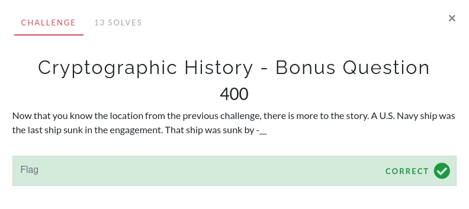

# Cryptographic History - Bonus Question

This question was unlocked after solving the "Cryptographic History" challenge.

I searched for "Battle of Midway" and read through [this website](https://www.history.com/topics/world-war-ii/battle-of-midway). I skipped the Wikipedia link since it had too much information to sift through. This was a timed competition so I did not have time to read through everything for one small detail.

The page linked above states that "a Japanese submarine arrived on June 6 and launched four torpedoes that struck both U.S. ships. The Hammann sank in minutes" near the bottom. Looking at the [USS Hammann Wikipedia Page](https://en.wikipedia.org/wiki/USS_Hammann_(DD-412) tells me that it was sunk by the Japanese submarine I-168.

The flag is `I-168`
