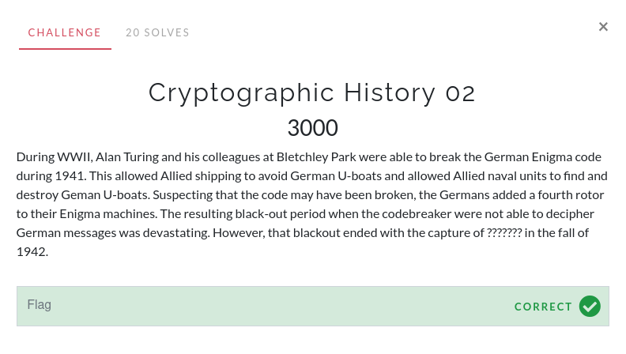

# Cryptographic History 02

For this challenge, I searched "fourth rotor enigma cracked". I came across this [Cryptanalysis of the Enigma Wikipedia page](https://en.wikipedia.org/wiki/Cryptanalysis_of_the_Enigma).

Scrolling down to the [4-rotor section](https://en.wikipedia.org/wiki/Cryptanalysis_of_the_Enigma#M4_(German_Navy_4-rotor_Enigma), it says that the code book had been captured from U-110 on 9 May 1941.

The flag is `U-110`.

Note: My competition notes had U-110 as the correct answer yet U-110 was captured in the spring of 1941. I may have put down the wrong boat (U-110 instead of U-550) or the problem was incorrectly written.
