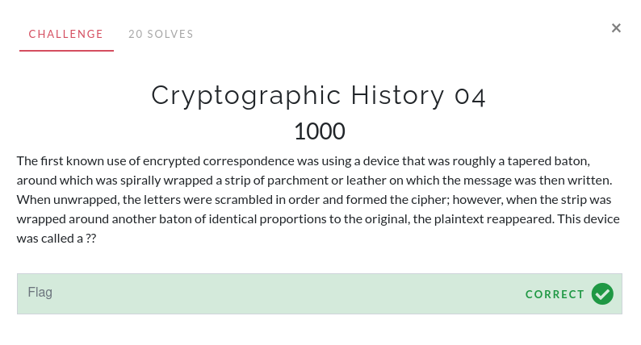

# Cryptographic History 04

I searched up "first known use of encryption". A [Wikipedia article on the history of cryptography](https://en.wikipedia.org/wiki/History_of_cryptography) came up. Reading through, the first **device** mentioned was the scytale.

The flag is `scytale`.
