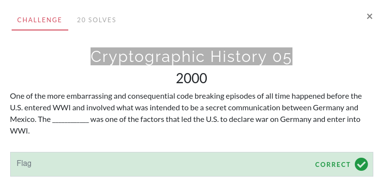

# Cryptographic History 05

This challenge was solved using prior knowledge. If you just search up "secret communication between germany mexico world war 1" though, your answer will pop up.

The flag is `Zimmerman Telegram`.
