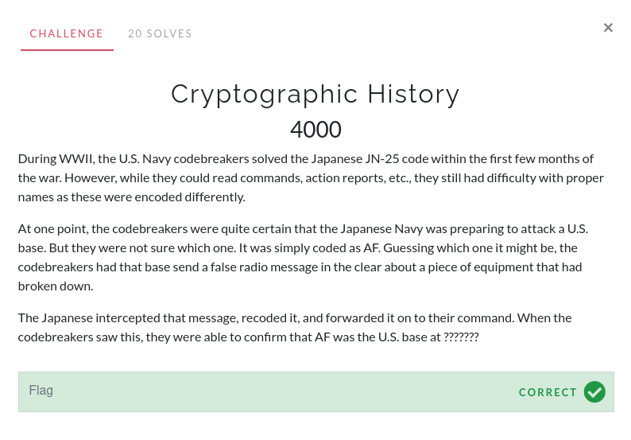

# Cryptographic History

This challenge was solved using prior knowledge. However, you could have searched up "japanese us base AF code world war 2". Many websites discussing the Battle of Midway will appear. Since the US had a base at Midway, it's safe to assume that it is the flag.

The flag is `Midway`.
