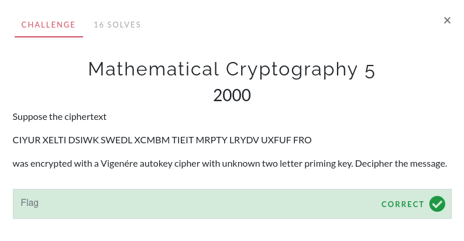
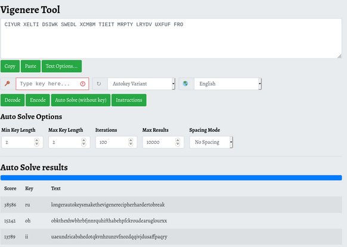

# Mathematical Cryptography 5

For this challenge, it gives us a ciphertext, which was encrypted using a Vigenére autokey cipher and an unknown two letter key. Searching up "vignere autokey decrypt" yields the following [Vigenére solver](https://www.boxentriq.com/code-breaking/vigenere-cipher).

Input the ciphertext, change the mode to "autokey" and change the key length.

Copy the first result into a text editor or notepad and add spaces.

The flag is `longer autokeys make the vigenere cipher harder to break`.
