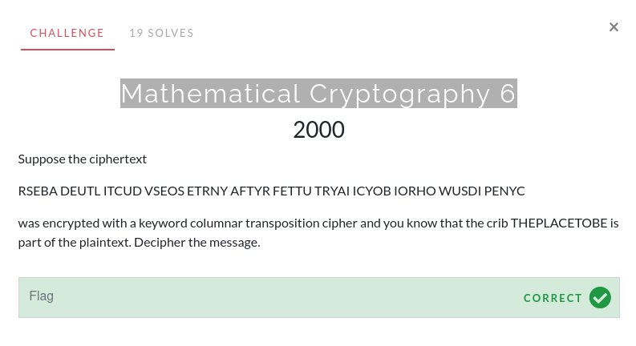
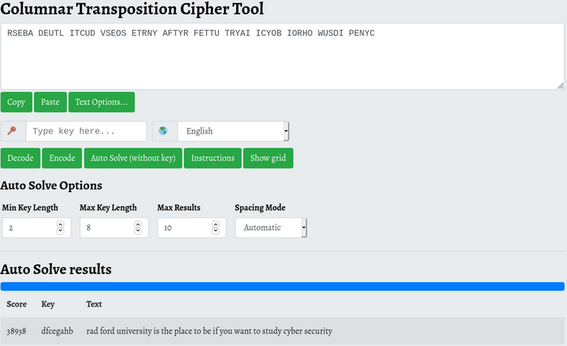

# Mathematical Cryptography 6

This challenge tells us that the ciphertext was encrypted using a keyword columar transposition cipher. Searching "columar transposition cipher decoder" yields the following [decoder](https://www.boxentriq.com/code-breaking/columnar-transposition-cipher).

Input the ciphertext and autosolve. While a crib is given, it is not needed.

Make sure that the spacing is correct with this answer. The website's automatic spacing mode may not be entirely accurate.

The flag is `radford university is the place to be if you want to study cybersecurity`.
