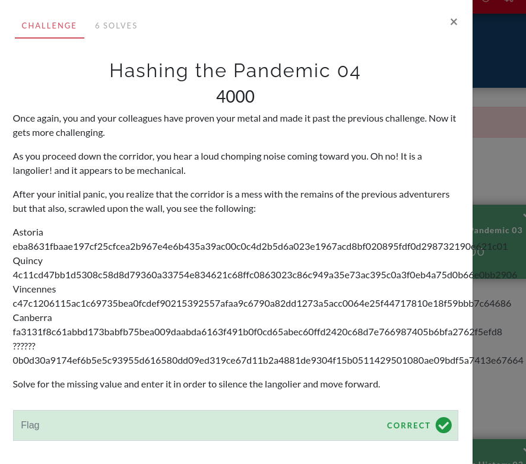
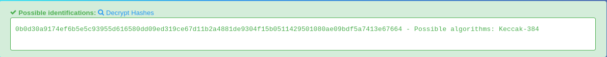

# Hashing the Pandemic 04

In this challenge you are provided with a names along with their respective hashes. When looking at this challenge initally, I thought about brute-forcing it. This is because hashes in the previous challenges were quite common words. Therefore, you could have just looked in a database of hashes to find the solution. The names listed in this challenge, however, are quite uncommon names, which means its unlikely that they are in a database of hashes.

When brtue-forcing a hash, you first need to know what hash it is. I used this [online hash-identifier tool](https://hashes.com/en/tools/hash_identifier) to identify the hash `0b0d30a9174ef6b5e5c93955d616580dd09ed319ce67d11b2a4881de9304f15b0511429501080ae09bdf5a7413e67664`. Make sure to click the box saying "Include all possibilities".

The website returns the algorithm "Keccak-384".

Now, you will need to use a tool to brute-force the hash. The most common one is hashcat. It is pre-installed on Kali Linux and it's relatively easy to install on other Linux-based distros. If you do not have a Kali Linux VM, then I highly recommend you set one up. You can always turn it off when you are not using it.

You will also need a wordlist. Technically, you could just run it iteratively. That means the program would start at the letter a and try the letters a-z. If the hashes returned do not match your hash, then it will move on. It will start with the word aa then go through the word zz. Once you get to 6+ letter words, however, this method becomes quite inefficient. You're effectively gambling that the writer of the challenge chose a word with a few letters. Unless a writer hints at using a short word, then I recommend you use a wordlist instead.

A wordlist is exactly what it sounds like. A list of words. You can test all of the words on the wordlist and see if their hashes match your hash. For this challenge, I will be using the wordlist "rockyou.txt". On Kali Linux, it is pre-installed in the `/usr/share/wordlists/` folder. Make sure to navigate to that folder and unzip `rockyou.txt` as it is zipped. Using the command `gzip -d rockyou.txt.gz`, it should unzip rockyou.txt in your current folder (`/usr/share/wordlists/`).

Now, place your hash in a temporary file. You can do this with `echo "0b0d30a9174ef6b5e5c93955d616580dd09ed319ce67d11b2a4881de9304f15b0511429501080ae09bdf5a7413e67664" > temp.hash`. Personally, I navigated to `/tmp` before running this command but you can also navigate to `~` and just delete the file later.

Once you do that, the fun begins! The command I came up with was `hashcat -m 17900 -a 0 temp.hash /usr/share/wordlists/rockyou.txt --show`. The `-m 17900` indicates that I am inputting a Keccak-384 hash. The `-a 0` flag says to use wordlist mode. The `temp.hash` is the file with your hash (make sure it ends in .hash`) and `/usr/share/wordlists/rockyou.txt`was the path to my rockyou.txt file. The`--show` simply says to show you the hash once crackied. Now, let the command run for a bit and work on another challenge.

When the command is finished running, you should see the line `0b0d30a9174ef6b5e5c93955d616580dd09ed319ce67d11b2a4881de9304f15b0511429501080ae09bdf5a7413e67664:Atlanta`. The text to the left of the colon is your hash. The text to your right is the word that is associated with the hash.

The flag is `Atlanta`.
